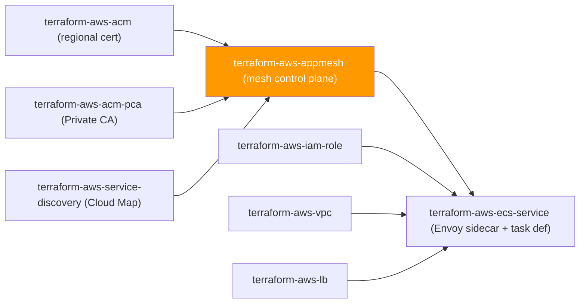
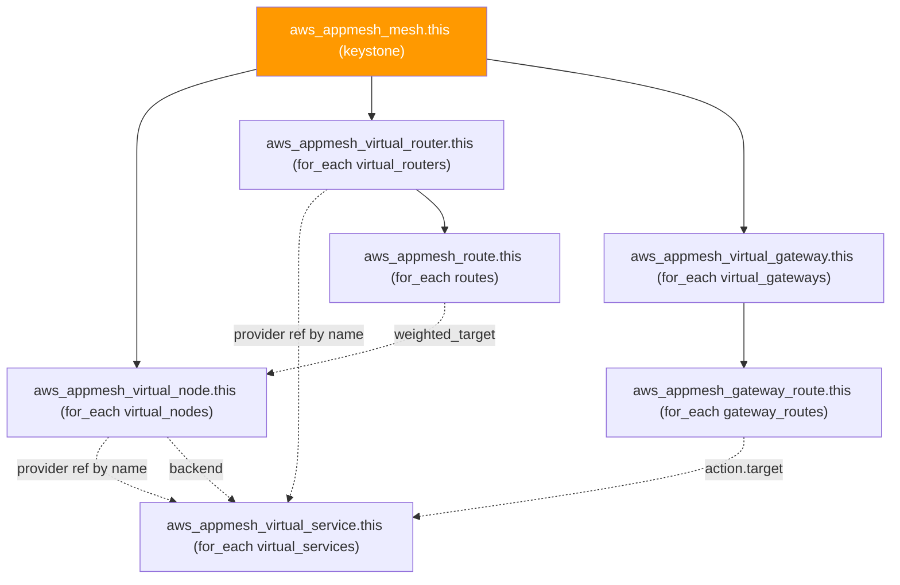

# 🟧 AWS **App Mesh** Terraform Module

> **Secure-by-default AWS App Mesh service mesh control plane** — mesh, virtual nodes, virtual routers, virtual gateways, virtual services, routes, and gateway routes, all wired together with deeply-typed `object` schemas and explicit-allow egress. Built for the AWS provider **v6.x**.


---

## 🧩 Overview

- 🕸️ Creates the **App Mesh service mesh** (`aws_appmesh_mesh.this`) — the keystone every other object in this module attaches to.
- 🧱 Renders **virtual nodes**, **virtual routers**, **virtual gateways**, and **virtual services** as `for_each` maps keyed by a caller-supplied stable name — add or remove one without disturbing the others.
- 🔀 Wires **routes** (virtual-router-attached) and **gateway routes** (virtual-gateway-attached), each with http/http2/grpc/tcp match, weighted-target actions, retry policies, and timeouts.
- 🔒 Defaults the mesh **egress filter to `DROP_ALL`** — a virtual node may only reach the backends it explicitly declares; nothing leaks out by accident.
- 🔐 Every listener/gateway-listener TLS block is deeply typed (`acm`/`file`/`sds` certificate sources, `acm`/`file`/`sds` — or **`file`/`sds` only** for listener-context trust, a genuine App Mesh API asymmetry) so a caller who fat-fingers a field gets a type error at plan time.
- 📝 Recommends Envoy **access logging** (`logging_access_log_path`) on every virtual node/gateway carrying PII-adjacent traffic.
- 🚫 Deliberately **data-plane-agnostic** — this module never touches an ECS task definition or EKS manifest; it only emits the ARNs/names the Envoy sidecar needs (wire them into `terraform-aws-ecs-service`).

> 💡 **Why it matters:** a service mesh's security posture lives entirely in its control-plane configuration — egress filters, TLS mode, and mTLS trust chains — so getting those defaults right here is what keeps a compromised sidecar from becoming a lateral-movement path across every other service in the mesh.

> ℹ️ **Reduced AWS investment in App Mesh.** AWS has publicly signaled reduced investment in App Mesh in favor of **ECS Service Connect** and **EKS-native mesh integrations** (VPC Lattice, Istio/Cilium add-ons). Confirm App Mesh is still the right long-term architecture for a *new* workload before building on it — see `SCOPE.md` for the full discussion. This module remains fully supported for existing/planned App Mesh estates.

---

## ❤️ Support this project

If these Terraform modules have been helpful to you or your organization, I'd appreciate your support in any of the following ways:

- ⭐ **Star this repository** to help others discover this Terraform module.
- 🤝 **Connect with me on LinkedIn:** [linkedin.com/in/microsoftexpert](https://www.linkedin.com/in/microsoftexpert)
- ☕ **Buy me a coffee:** [buymeacoffee.com/microsoftexpert](https://buymeacoffee.com/microsoftexpert)

Whether it's a star, a professional connection, or a coffee, every gesture helps keep these modules actively maintained and continually improving. Thank you for being part of the community!

---

## 🗺️ Where this fits in the family



---

## 🧬 What this module builds



---

## ✅ Provider / Versions

| Requirement | Version |
|---|---|
| Terraform | `>= 1.12.0` |
| `hashicorp/aws` | `>= 6.0, < 7.0` |

---

## 🔑 Required IAM Permissions

| Action | Required for | Notes |
|---|---|---|
| `appmesh:CreateMesh`, `appmesh:DescribeMesh`, `appmesh:UpdateMesh`, `appmesh:DeleteMesh`, `appmesh:ListMeshes` | Mesh lifecycle | — |
| `appmesh:CreateVirtualNode`, `appmesh:DescribeVirtualNode`, `appmesh:UpdateVirtualNode`, `appmesh:DeleteVirtualNode`, `appmesh:ListVirtualNodes` | Virtual node lifecycle | — |
| `appmesh:CreateVirtualRouter`, `appmesh:DescribeVirtualRouter`, `appmesh:UpdateVirtualRouter`, `appmesh:DeleteVirtualRouter`, `appmesh:ListVirtualRouters` | Virtual router lifecycle | — |
| `appmesh:CreateVirtualGateway`, `appmesh:DescribeVirtualGateway`, `appmesh:UpdateVirtualGateway`, `appmesh:DeleteVirtualGateway`, `appmesh:ListVirtualGateways` | Virtual gateway lifecycle | — |
| `appmesh:CreateVirtualService`, `appmesh:DescribeVirtualService`, `appmesh:UpdateVirtualService`, `appmesh:DeleteVirtualService`, `appmesh:ListVirtualServices` | Virtual service lifecycle | — |
| `appmesh:CreateRoute`, `appmesh:DescribeRoute`, `appmesh:UpdateRoute`, `appmesh:DeleteRoute`, `appmesh:ListRoutes` | Route lifecycle | — |
| `appmesh:CreateGatewayRoute`, `appmesh:DescribeGatewayRoute`, `appmesh:UpdateGatewayRoute`, `appmesh:DeleteGatewayRoute`, `appmesh:ListGatewayRoutes` | Gateway route lifecycle | — |
| `appmesh:TagResource`, `appmesh:UntagResource` | Tag management on every object above | — |

No `iam:PassRole` is required by this module. No service-linked role is auto-created by App Mesh.

---

## 📋 AWS Prerequisites

- **No service-linked role** is required for App Mesh.
- **Data-plane sidecar is NOT managed here.** App Mesh only takes effect once the Envoy proxy container is injected into the ECS task definition (`proxy_configuration { type = "APPMESH" }` plus the `APPMESH_RESOURCE_ARN` environment variable pointing at this module's `virtual_node_arns[key]` output) or the EKS pod spec (via the App Mesh Kubernetes controller). Wire this module's outputs into `terraform-aws-ecs-service`.
- **Region:** App Mesh is a regional service — no `us-east-1` constraint. Standard provider inheritance; no `region` variable in this module.
- **Cloud Map dependency:** `aws_cloud_map` service discovery requires an existing namespace/service (`terraform-aws-service-discovery`) created first.
- **Quotas:** 250 meshes per account (soft), 5,000 virtual nodes / 5,000 virtual services per mesh, 10 listeners per virtual node (soft).
- **Strategic note:** confirm App Mesh (vs. ECS Service Connect / EKS-native mesh) is the intended long-term architecture — see the `> ℹ️` callout above.

---

## 📁 Module Structure

```
terraform-aws-appmesh/
├── providers.tf
├── variables.tf
├── main.tf
├── outputs.tf
├── README.md
└── SCOPE.md
```

---

## ⚙️ Quick Start

```hcl
module "mesh" {
  source = "git::https://github.com/microsoftexpert/terraform-aws-appmesh?ref=v1.0.0"

  mesh_name = "core-mesh"

  virtual_nodes = {
    payments = {
      listeners = [{
        port_mapping = { port = 8080, protocol = "http" }
      }]
      service_discovery = {
        dns = { hostname = "payments.internal.local" }
      }
      logging_access_log_path = "/dev/stdout"
    }
  }

  virtual_services = {
    "payments.internal.local" = {
      provider_virtual_node_key = "payments"
    }
  }

  tags = {
    Environment = "prod"
    Owner       = "platform-eng"
  }
}
```

---

## 🔌 Cross-Module Contract

### Consumes

| Input | Type | Source module |
|---|---|---|
| `virtual_nodes[*].service_discovery.aws_cloud_map.namespace_name` / `.service_name` | `string` | `terraform-aws-service-discovery` |
| `virtual_nodes[*].listeners[*].tls.certificate.acm.certificate_arn` | `string` (ARN) | `terraform-aws-acm` (regional cert) |
| `virtual_gateways[*].listener.tls.certificate.acm.certificate_arn` | `string` (ARN) | `terraform-aws-acm` (regional cert) |
| `*.tls.validation.trust.acm.certificate_authority_arns` | `list(string)` (ARNs) | `terraform-aws-acm-pca` |

### Emits

| Output | Description | Consumed by |
|---|---|---|
| `id` | Mesh id (= mesh name) | Cross-references within this module |
| `arn` | Mesh ARN | IAM policies scoping `appmesh:*` |
| `virtual_node_ids` / `virtual_node_arns` / `virtual_node_names` | Map keyed by caller key | `terraform-aws-ecs-service` (`APPMESH_RESOURCE_ARN`, `proxy_configuration`) |
| `virtual_router_ids` / `virtual_router_arns` / `virtual_router_names` | Map keyed by caller key | Route wiring, monitoring |
| `virtual_gateway_ids` / `virtual_gateway_arns` / `virtual_gateway_names` | Map keyed by caller key | Gateway route wiring, ECS/EKS gateway task |
| `virtual_service_ids` / `virtual_service_arns` / `virtual_service_names` | Map keyed by caller key | Client-side virtual node `backend` references, gateway route targets |
| `route_ids` / `route_arns` | Map keyed by caller key | CloudWatch dashboards |
| `gateway_route_ids` / `gateway_route_arns` | Map keyed by caller key | CloudWatch dashboards |
| `tags_all` | Mesh tags including provider `default_tags` | Governance/audit |

---

## 📚 Example Library

<details><summary><strong>1 · Minimal mesh (no children)</strong></summary>

```hcl
module "mesh" {
  source = "git::https://github.com/microsoftexpert/terraform-aws-appmesh?ref=v1.0.0"

  mesh_name = "sandbox-mesh"
}
```

> Secure by default even here — `egress_filter_type` defaults to `DROP_ALL`.
</details>

<details><summary><strong>2 · Virtual node with DNS service discovery</strong></summary>

```hcl
module "mesh" {
  source = "git::https://github.com/microsoftexpert/terraform-aws-appmesh?ref=v1.0.0"

  mesh_name = "core-mesh"

  virtual_nodes = {
    orders = {
      listeners = [{
        port_mapping = { port = 8080, protocol = "http" }
      }]
      service_discovery = {
        dns = { hostname = "orders.internal.local" }
      }
    }
  }
}
```
</details>

<details><summary><strong>3 · Virtual node with AWS Cloud Map service discovery</strong></summary>

```hcl
module "mesh" {
  source = "git::https://github.com/microsoftexpert/terraform-aws-appmesh?ref=v1.0.0"

  mesh_name = "core-mesh"

  virtual_nodes = {
    orders = {
      listeners = [{ port_mapping = { port = 8080, protocol = "http" } }]
      service_discovery = {
        aws_cloud_map = {
          namespace_name = module.cloud_map_namespace.namespace_name
          service_name   = "orders"
        }
      }
    }
  }
}
```
</details>

<details><summary><strong>4 · TLS-terminating listener with an ACM certificate (STRICT mode)</strong></summary>

```hcl
module "mesh" {
  source = "git::https://github.com/microsoftexpert/terraform-aws-appmesh?ref=v1.0.0"

  mesh_name = "core-mesh"

  virtual_nodes = {
    payments = {
      listeners = [{
        port_mapping = { port = 8443, protocol = "http" }
        tls = {
          mode = "STRICT"
          certificate = {
            acm = { certificate_arn = module.acm_payments.arn }
          }
        }
      }]
      service_discovery = {
        dns = { hostname = "payments.internal.local" }
      }
      logging_access_log_path = "/dev/stdout"
    }
  }
}
```

> `STRICT` + an ACM-issued regional certificate is the recommended posture for any listener carrying PII-adjacent traffic.
</details>

<details><summary><strong>5 · Mutual TLS with a Private CA on a backend client policy</strong></summary>

```hcl
module "mesh" {
  source = "git::https://github.com/microsoftexpert/terraform-aws-appmesh?ref=v1.0.0"

  mesh_name = "core-mesh"

  virtual_nodes = {
    orders = {
      listeners = [{ port_mapping = { port = 8080, protocol = "http" } }]
      backends = [{
        virtual_service_name = "payments.internal.local"
        client_policy_tls = {
          enforce = true
          validation = {
            trust = {
              acm = { certificate_authority_arns = [module.private_ca.arn] }
            }
          }
        }
      }]
    }
  }
}
```
</details>

<details><summary><strong>6 · Virtual router + HTTP route with a weighted canary split</strong></summary>

```hcl
module "mesh" {
  source = "git::https://github.com/microsoftexpert/terraform-aws-appmesh?ref=v1.0.0"

  mesh_name = "core-mesh"

  virtual_nodes = {
    orders_v1 = { listeners = [{ port_mapping = { port = 8080, protocol = "http" } }] }
    orders_v2 = { listeners = [{ port_mapping = { port = 8080, protocol = "http" } }] }
  }

  virtual_routers = {
    orders = {
      listeners = [{ port_mapping = { port = 8080, protocol = "http" } }]
    }
  }

  virtual_services = {
    "orders.internal.local" = {
      provider_virtual_router_key = "orders"
    }
  }

  routes = {
    orders-canary = {
      virtual_router_key = "orders"
      http_route = {
        match = { prefix = "/" }
        action = {
          weighted_targets = [
            { virtual_node_key = "orders_v1", weight = 90 },
            { virtual_node_key = "orders_v2", weight = 10 },
          ]
        }
      }
    }
  }
}
```
</details>

<details><summary><strong>7 · HTTP route with a retry policy</strong></summary>

```hcl
module "mesh" {
  source = "git::https://github.com/microsoftexpert/terraform-aws-appmesh?ref=v1.0.0"

  mesh_name = "core-mesh"

  virtual_nodes = {
    orders = { listeners = [{ port_mapping = { port = 8080, protocol = "http" } }] }
  }
  virtual_routers = {
    orders = { listeners = [{ port_mapping = { port = 8080, protocol = "http" } }] }
  }

  routes = {
    orders-resilient = {
      virtual_router_key = "orders"
      http_route = {
        match  = { prefix = "/" }
        action = { weighted_targets = [{ virtual_node_key = "orders", weight = 100 }] }
        retry_policy = {
          http_retry_events = ["server-error", "gateway-error"]
          max_retries       = 2
          per_retry_timeout = { unit = "s", value = 15 }
        }
      }
    }
  }
}
```
</details>

<details><summary><strong>8 · gRPC route with method-name match</strong></summary>

```hcl
module "mesh" {
  source = "git::https://github.com/microsoftexpert/terraform-aws-appmesh?ref=v1.0.0"

  mesh_name = "core-mesh"

  virtual_nodes = {
    ledger = { listeners = [{ port_mapping = { port = 50051, protocol = "grpc" } }] }
  }
  virtual_routers = {
    ledger = { listeners = [{ port_mapping = { port = 50051, protocol = "grpc" } }] }
  }

  routes = {
    ledger-write = {
      virtual_router_key = "ledger"
      grpc_route = {
        match  = { service_name = "ledger.LedgerService", method_name = "WriteEntry" }
        action = { weighted_targets = [{ virtual_node_key = "ledger", weight = 100 }] }
      }
    }
  }
}
```
</details>

<details><summary><strong>9 · TCP route (no HTTP semantics)</strong></summary>

```hcl
module "mesh" {
  source = "git::https://github.com/microsoftexpert/terraform-aws-appmesh?ref=v1.0.0"

  mesh_name = "core-mesh"

  virtual_nodes = {
    cache = { listeners = [{ port_mapping = { port = 6379, protocol = "tcp" } }] }
  }
  virtual_routers = {
    cache = { listeners = [{ port_mapping = { port = 6379, protocol = "tcp" } }] }
  }

  routes = {
    cache-route = {
      virtual_router_key = "cache"
      tcp_route = {
        action = { weighted_targets = [{ virtual_node_key = "cache", weight = 100 }] }
      }
    }
  }
}
```
</details>

<details><summary><strong>10 · Virtual gateway with TLS + gateway route to a virtual service</strong></summary>

```hcl
module "mesh" {
  source = "git::https://github.com/microsoftexpert/terraform-aws-appmesh?ref=v1.0.0"

  mesh_name = "core-mesh"

  virtual_nodes = {
    web = { listeners = [{ port_mapping = { port = 8080, protocol = "http" } }] }
  }
  virtual_services = {
    "web.internal.local" = { provider_virtual_node_key = "web" }
  }

  virtual_gateways = {
    ingress = {
      listener = {
        port_mapping = { port = 443, protocol = "http" }
        tls = {
          mode        = "STRICT"
          certificate = { acm = { certificate_arn = module.acm_gateway.arn } }
        }
      }
      logging_access_log_path = "/dev/stdout"
    }
  }

  gateway_routes = {
    ingress-web = {
      virtual_gateway_key = "ingress"
      http_route = {
        match  = { prefix = "/" }
        action = { target = { virtual_service_key = "web.internal.local" } }
      }
    }
  }
}
```
</details>

<details><summary><strong>11 · Gateway route with a hostname rewrite</strong></summary>

```hcl
module "mesh" {
  source = "git::https://github.com/microsoftexpert/terraform-aws-appmesh?ref=v1.0.0"

  mesh_name = "core-mesh"

  virtual_gateways = {
    ingress = {
      listener = { port_mapping = { port = 8080, protocol = "http" } }
    }
  }
  virtual_services = {
    "web.internal.local" = {}
  }

  gateway_routes = {
    ingress-rewrite = {
      virtual_gateway_key = "ingress"
      http_route = {
        match = { prefix = "/api/" }
        action = {
          target = { virtual_service_key = "web.internal.local" }
          rewrite = {
            prefix = { value = "/" }
          }
        }
      }
    }
  }
}
```
</details>

<details><summary><strong>12 · Mesh-level egress opt-out (ALLOW_ALL — documented exception)</strong></summary>

```hcl
module "mesh" {
  source = "git::https://github.com/microsoftexpert/terraform-aws-appmesh?ref=v1.0.0"

  mesh_name          = "legacy-migration-mesh"
  egress_filter_type = "ALLOW_ALL" # documented exception — migration window only
}
```

> Weakens mesh-level egress control. Revert to the `DROP_ALL` default once every virtual node declares its `backend` list explicitly.
</details>

<details><summary><strong>13 · Tags merging with provider default_tags</strong></summary>

```hcl
provider "aws" {
  region = "us-east-2"
  default_tags {
    tags = {
      CostCenter = "platform-eng"
      ManagedBy  = "terraform"
    }
  }
}

module "mesh" {
  source = "git::https://github.com/microsoftexpert/terraform-aws-appmesh?ref=v1.0.0"

  mesh_name = "core-mesh"

  tags = {
    Environment = "prod" # merges with default_tags; resource tags win on key conflict
  }
}
```
</details>

<details><summary><strong>14 · Import an existing mesh and virtual node</strong></summary>

```hcl
import {
  to = module.mesh.aws_appmesh_mesh.this
  id = "core-mesh"
}

import {
  to = module.mesh.aws_appmesh_virtual_node.this["orders"]
  id = "core-mesh/orders"
}
```
</details>

<details><summary><strong>15 · 🏗️ End-to-end composition — mesh + ECS service with Envoy sidecar</strong></summary>

```hcl
module "mesh" {
  source = "git::https://github.com/microsoftexpert/terraform-aws-appmesh?ref=v1.0.0"

  mesh_name = "core-mesh"

  virtual_nodes = {
    orders = {
      listeners = [{ port_mapping = { port = 8080, protocol = "http" } }]
      service_discovery = {
        aws_cloud_map = {
          namespace_name = module.cloud_map_namespace.namespace_name
          service_name   = "orders"
        }
      }
      logging_access_log_path = "/dev/stdout"
    }
  }

  virtual_services = {
    "orders.internal.local" = { provider_virtual_node_key = "orders" }
  }
}

module "orders_service" {
  source = "git::https://github.com/microsoftexpert/terraform-aws-ecs-service?ref=v1.0.0"

  name        = "orders"
  cluster_arn = module.ecs_cluster.arn
  family      = "orders"

  execution_role_arn = module.orders_execution_role.arn
  task_role_arn      = module.orders_task_role.arn

  # Envoy sidecar wiring: proxy_configuration + container_definitions (rendered
  # separately) reference module.mesh.virtual_node_arns["orders"] via the
  # APPMESH_RESOURCE_ARN container environment variable and
  # proxy_configuration { type = "APPMESH" }.
  proxy_configuration = {
    container_name = "envoy"
  }

  subnet_ids         = module.vpc.private_subnet_ids
  security_group_ids = [module.ecs_sg.id]

  container_definitions = jsonencode([
    {
      name  = "orders"
      image = "123456789012.dkr.ecr.us-east-2.amazonaws.com/orders:latest"
    },
    {
      name  = "envoy"
      image = "840364872350.dkr.ecr.us-east-2.amazonaws.com/aws-appmesh-envoy:v1.29.9.0-prod"
      environment = [
        { name = "APPMESH_RESOURCE_ARN", value = module.mesh.virtual_node_arns["orders"] }
      ]
    }
  ])
}
```
</details>

---

## 📥 Inputs

**Core**
- `mesh_name` — mesh name (FORCE-NEW)
- `egress_filter_type` — `DROP_ALL` (default, secure) or `ALLOW_ALL`
- `mesh_service_discovery_ip_preference` — mesh-wide IP version preference

**Child collections (all `map(object(...))`, `for_each`, default `{}`)**
- `virtual_nodes` — listeners, backends, backend_defaults, service_discovery, logging
- `virtual_routers` — listeners
- `virtual_gateways` — listener (required, singular), backend_defaults, logging
- `virtual_services` — provider (virtual_node OR virtual_router, by sibling key)
- `routes` — attached to a virtual_router_key; http/http2/grpc/tcp match+action+retry+timeout
- `gateway_routes` — attached to a virtual_gateway_key; http/http2/grpc match+action(+rewrite for http/http2 only)

**Tail**
- `tags` — merged with provider `default_tags`; per-item `tags` in each child map merge over this

> No `timeouts` variable — the App Mesh resource schema has no configurable `timeouts` block (all operations are synchronous via the control-plane API).

---

## 🧾 Outputs

- `id`, `arn`, `name`, `mesh_owner`, `resource_owner` — mesh keystone
- `virtual_node_ids` / `virtual_node_arns` / `virtual_node_names` — maps keyed by caller key
- `virtual_router_ids` / `virtual_router_arns` / `virtual_router_names` — maps keyed by caller key
- `virtual_gateway_ids` / `virtual_gateway_arns` / `virtual_gateway_names` — maps keyed by caller key
- `virtual_service_ids` / `virtual_service_arns` / `virtual_service_names` — maps keyed by caller key
- `route_ids` / `route_arns` — maps keyed by caller key
- `gateway_route_ids` / `gateway_route_arns` — maps keyed by caller key
- `tags_all` — merged tags on the mesh, including provider `default_tags`

No output in this module is `sensitive = true` — App Mesh resources carry no secrets (TLS material is referenced by ARN/name, never inlined).

---

## 🧠 Architecture Notes

- **ARN format:** `arn:aws:appmesh:<region>:<account>:mesh/<mesh_name>` for the mesh; child objects append `/virtualNode/<name>`, `/virtualRouter/<name>`, `/virtualGateway/<name>`, `/virtualService/<name>`, `/virtualRouter/<router>/route/<name>`, `/virtualGateway/<gateway>/gatewayRoute/<name>` respectively.
- **`name` is FORCE-NEW on every object** — there is no in-place rename. Renaming `mesh_name` cascades to every child resource in this module.
- **Cross-references are by NAME, not ARN**, at the App Mesh API level (virtual service `provider`, route `weighted_target.virtual_node`, gateway route `action.target.virtual_service_name`). This module always passes the resource **attribute** (`aws_appmesh_virtual_node.this[key].name`) rather than a bare caller string, so Terraform's dependency graph — not creation-order luck — governs apply/destroy order.
- **`tags` ↔ `tags_all` ↔ `default_tags`:** every object in this module accepts `tags` (merged with `var.tags`); only the mesh surfaces a `tags_all` output (App Mesh's other resources compute `tags_all` internally but this module does not surface a redundant output per child object — read them back via a data source or plan output if needed).
- **Schema asymmetry — listener TLS trust vs. client-policy TLS trust:** a listener's `tls.validation.trust` block supports only `file`/`sds` (no `acm`), while a `client_policy.tls.validation.trust` block (backends/backend_defaults) supports `acm`/`file`/`sds`. This module's variable types mirror that asymmetry exactly — do not "fix" it by adding `acm` to the listener path; the provider will reject it.
- **Schema asymmetry — gateway-route action rewrite:** `http_route`/`http2_route` gateway-route actions support an optional `rewrite` block; `grpc_route` gateway-route actions do not (rewrite is an HTTP-only concept).
- **No `timeouts` block** — App Mesh resource operations complete synchronously via the control-plane API; there is nothing to configure.
- **No `us-east-1` global-resource requirement** — App Mesh is fully regional.
- **Destroy ordering:** virtual services must be destroyed before the virtual node/router they reference; gateway routes before their virtual gateway; routes before their virtual router. Terraform infers this automatically from the by-name references above, but a manual `-target` destroy sequence must respect it too.

---

## 🧱 Design Principles

- **Mesh egress is DROP_ALL by default.** A virtual node may only reach backends it explicitly declares. Opt out with `egress_filter_type = "ALLOW_ALL"` (documented exception).
- **No forced TLS mode, but a strong recommendation.** The type system does not silently default a listener to `STRICT` (a caller who omits `tls` entirely gets an unencrypted listener), but every example and the SCOPE.md explicitly recommend `STRICT` with an ACM-issued cert for PII-adjacent listeners. Treat "no `tls` block" as a decision requiring sign-off, not an oversight.
- **Client-policy TLS enforcement defaults to `enforce = true`** when a caller supplies `client_policy_tls` at all — matching the App Mesh/provider default. Set `enforce = false` for a documented exception (allow both encrypted and unencrypted upstream connections).
- **Access logging is opt-in but strongly recommended** (`logging_access_log_path`) — leaving it `null` disables Envoy access logs, reducing auditability for PII-adjacent services.
- **Deeply-typed `object` schemas throughout** — no `any`, no loose `map` for structured data, including the two schema asymmetries called out in Architecture Notes.
- **Keyed `for_each` maps, never `count`** — every child collection (nodes, routers, gateways, services, routes, gateway routes) is addressable and removable independently.
- **Data-plane-agnostic by design** — this module never configures an ECS task definition or EKS manifest; `terraform-aws-ecs-service` (or a future EKS-side module) owns Envoy sidecar injection.

---

## 🚀 Runbook

```powershell
cd terraform-aws-appmesh
terraform init -backend=false
terraform validate
terraform fmt -check
terraform plan # requires valid AWS credentials (profile/SSO/OIDC) and a region
terraform apply
terraform output
```

> ⚠️ Always pin the module source with `?ref=v1.0.0` (an immutable tag), never a branch — App Mesh's by-name cross-references make an in-flight schema change during a live migration especially risky to track down.

---

## 🧪 Testing

- `terraform init -backend=false` / `terraform validate` / `terraform fmt -check` — all pass with zero errors.
- No live-credential test is part of this module's validation workflow (per this suite's "Plan-only discipline" convention). Validate structurally here; run `plan`/`apply` in a non-production account with a least-privilege role scoped to the `## Required IAM Permissions` table above.

---

## 💬 Example Output

```
$ terraform apply

module.mesh.aws_appmesh_mesh.this: Creating...
module.mesh.aws_appmesh_mesh.this: Creation complete after 1s [id=core-mesh]
module.mesh.aws_appmesh_virtual_node.this["orders"]: Creating...
module.mesh.aws_appmesh_virtual_node.this["orders"]: Creation complete after 1s [id=core-mesh/orders]
module.mesh.aws_appmesh_virtual_service.this["orders.internal.local"]: Creating...
module.mesh.aws_appmesh_virtual_service.this["orders.internal.local"]: Creation complete after 1s

Apply complete! Resources: 3 added, 0 changed, 0 destroyed.

Outputs:

arn = "arn:aws:appmesh:us-east-2:123456789012:mesh/core-mesh"
id = "core-mesh"
virtual_node_arns = {
 "orders" = "arn:aws:appmesh:us-east-2:123456789012:mesh/core-mesh/virtualNode/orders"
}
```

---

## 🔍 Troubleshooting

- **Tag drift from `default_tags` overlap** — resource tags win on key conflict; avoid duplicating the same key in both `provider.default_tags` and this module's `tags`. Check the merged result via the mesh's `tags_all` output.
- **Credential-chain failures on `plan`/`apply`** — App Mesh has no special credential requirements; standard AWS provider chain troubleshooting applies (env vars → SSO → `assume_role` → instance profile/IRSA → OIDC).
- **`Error: Unsupported block type` for `acm` under a listener's `validation.trust`** — this is not a bug in this module; the listener-context trust block genuinely does not support `acm` in the provider schema (only `file`/`sds`). Use `client_policy_tls.validation.trust.acm` on the backend/backend_defaults side instead, or issue a certificate the trust store can validate via `file`/`sds`.
- **`Error: Unsupported block type` for `rewrite` under a `grpc_route` gateway-route action** — `rewrite` is HTTP/HTTP2-only; remove it from `grpc_route.action`.
- **Envoy sidecar never registers / traffic never flows** — this module only creates control-plane objects. Confirm the ECS task definition has `proxy_configuration { type = "APPMESH" }`, an `envoy` container with `APPMESH_RESOURCE_ARN` set to this module's `virtual_node_arns[key]` output, and that the task/execution role has the App Mesh Envoy IAM policy attached (managed in `terraform-aws-ecs-service` / `terraform-aws-iam-role`, not here).
- **Virtual service `provider` mismatch after a rename** — because cross-references are by NAME, renaming a virtual node or router (FORCE-NEW) also recreates the virtual service's provider binding; expect a brief resolution gap for in-flight Envoy proxies until they refresh their config from the App Mesh control plane.
- **Destroy fails with a dependency error** — destroy gateway routes before their virtual gateway, routes before their virtual router, and virtual services before the virtual node/router they reference. Terraform infers this from the by-name references, but a manual `-target` sequence must respect the same order.
- **IAM permission denials** — the executing role is missing an action from the `## Required IAM Permissions` table; add the specific action, never broaden to `appmesh:*` in production.

---

## 🔗 Related Docs

- `aws_appmesh_mesh`, `aws_appmesh_virtual_node`, `aws_appmesh_virtual_router`, `aws_appmesh_virtual_gateway`, `aws_appmesh_virtual_service`, `aws_appmesh_route`, `aws_appmesh_gateway_route` provider documentation (Terraform Registry, `hashicorp/aws`)
- AWS App Mesh service documentation — Envoy proxy configuration, service discovery, and TLS
- This module's `SCOPE.md`
- Sibling modules: `terraform-aws-ecs-service` (data-plane sidecar), `terraform-aws-service-discovery` (Cloud Map), `terraform-aws-acm` / `terraform-aws-acm-pca` (TLS material)

---

> 🧡 *"Infrastructure as Code should be standardized, consistent, and secure."*
